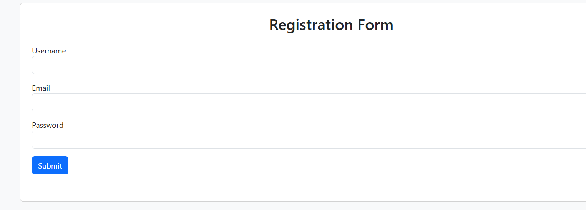
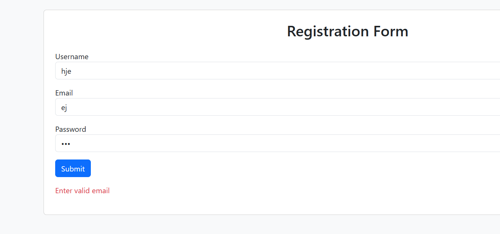

# JavaScript Client Side Validation

## Aim
To perform client-side validation using JavaScript for registration and login pages.

## Features
- Username validation
- Email validation
- Password validation
- Error message display
- Responsive design using Bootstrap

## Technologies Used
- HTML5
- Bootstrap 5
- JavaScript

## Files Included
- index.html
- script.js

## Output Screenshots

### Normal Form Output

### Validation Error Output

## GitHub Repository Link

https://github.com/malikabrar1897/js-validation

## GitHub Pages Link

https://malikabrar1897.github.io/js-validation/
